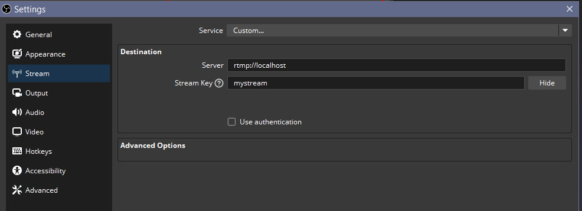
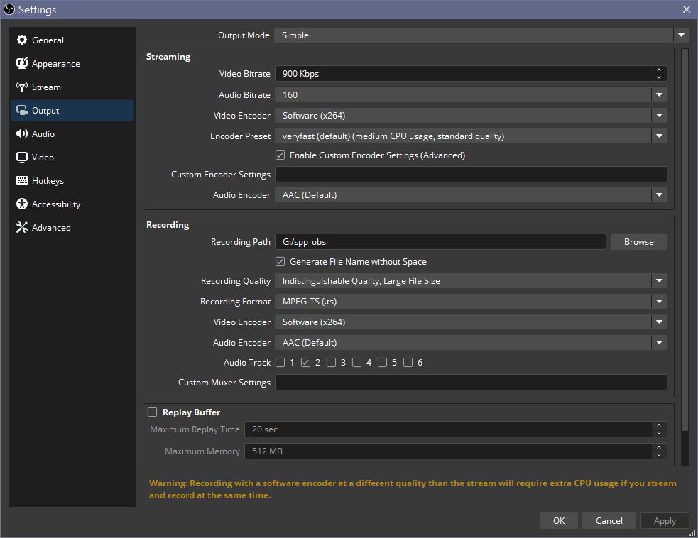
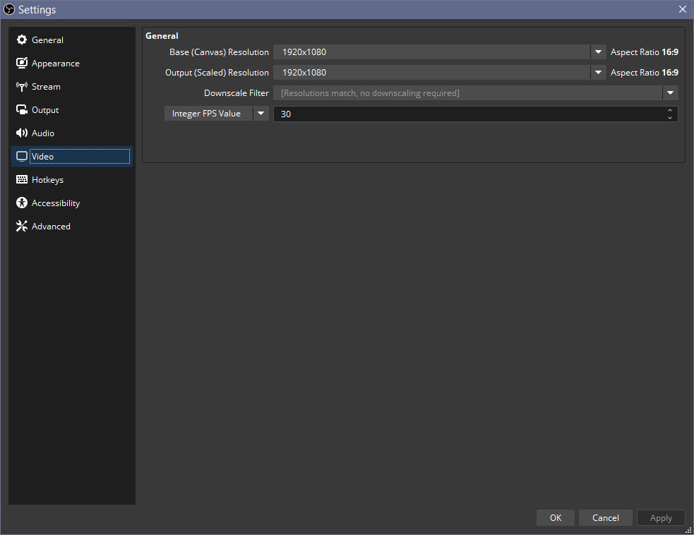
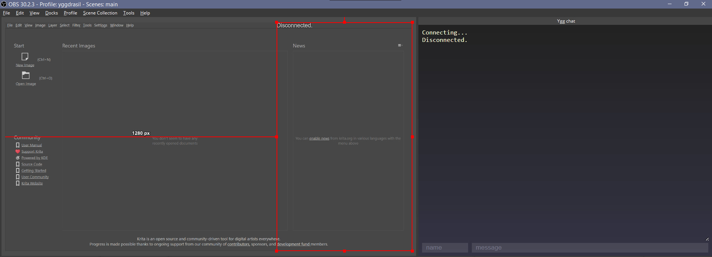

# Как стримить в сети Yggdrasil

Общий принцип аналогичен вещанию на twitch, youtube или произвольный сервис. В этом примере рассматривается стрим при помощи OBS и mediamtx. Настройка и запуск сервера одинаковы и для Windows, и для Linux.

Мediamtx требуется для раздачи RTMP/HLS потоков клиентам, он принимает входное видео от OBS. Сервер может быть расположен на другой машине с достижимым IP-адресом, так можно балансировать нагрузку и кэшировать видео.

Настройка OBS.

Удобнее всего изготовить отдельный профиль (в меню Profile -> Duplicate, Profile -> Rename) если OBS уже была прежде настроена для работы с другим сервисом, например Twitch.  
После смены профиля на Yggdrasil, нужно поменять настройки сервиса. Это делается в окне Settings -> вкладка Stream. Выбор сервиса находится вверху, там следует выбрать Custom, тогда OBS позволяет вписать адрес приёмника и ключ трансляции.  
В случае работы с mediamtx эти настройки таковы: сервер - `rtmp://localhost`, ключ - `mystream`

Настройки качества

С приведёнными настройками справляется i5-2310 с двухканальной памятью patriot viper 1333 MHz jedec

Прочих особых настроек OBS не требуется.

Настройка mediamtx.

Скачать mediamtx для windows можно по ссылке https://github.com/bluenviron/mediamtx/releases/download/v1.9.3/mediamtx_v1.9.3_windows_amd64.zip

В архиве есть файл mediamtx.yml с его настройками по умолчанию. Пояснения настроек:

Сохранять лог трансляции: поменять `logDestinations: [stdout]` на `logDestinations: [file]`  
Включить метрику медиасервера: поменять `metrics: no` на `metrics: yes`.  
Метрика доступна по умолчанию по адресу `http://127.0.0.1:9998` и имеет формат JSON. В ней перечисляются клиенты RTMP/HLS если они подключены, так можно смотреть количество зрителей трансляции. Нет смысла добавлять Custom browser докер в OBS для метрики, т. к. такой докер запрашивает страницу только один раз. Чтобы она была актуальной, нужно регулярно обновлять страницу, например парсить выдачу mediamtx и добавлять заголовок `refresh:`  
RTMP: `rtmp://[yggdrasil_ipv6]/mystream`  
HLS:  `http://[yggdrasil_ipv6]:8888/mystream/`  

Приём чата трансляции.

Для простого чата можно использовать https://github.com/Flynsarmy/PHPWebSocket-Chat
Если у вас старый PHP из комплекта DeNWeR, в нём отсутствует файл php_sockets.dll. Скачать его можно на https://www.pconlife.com/viewfileinfo/php-sockets-dll/ (следует соблюдать версию и разрядность при выборе нужного файла). Также следует раскомментировать (убрать точку с запятой) строку `;extension=php_sockets.dll` в php.ini  
Чтобы зрители стрима могли открывать чат по вашему внешнему IP в Yggdrasil, нужно либо дать им HTML-файл со страницей чата (в javascript которой вписан IP-адрес слушателя websocket, то есть PHP-бекенда чата), либо сделать этот HTML файл доступным по внешнему IP при помощи web-сервера, например Nginx.  
В php этот адрес указан в файле index.html, в строке  
`    Server = new FancyWebSocket('ws://127.0.0.1:9300');`  
Если не поменять его, чат будет работать только на локальной машине.  

Запуск бекенда: команда `start "" php.exe server.php`

Вывод чата трансляции.

Чтобы чат показывался на стриме, нужно сделать копию файла index.html, например overlay.html, которая будет иметь прозрачный фон. Желательно добавить контур текста, например объявив для textarea CSS-тень:  
`#log {font: 20pt arial; text-shadow: -3px -3px 0 #000, 3px -3px 0 #000, -3px 3px 0 #000, 3px 3px 0 #000;}`  
Этот файл overlay.html нужно добавить в сцену в качестве Browser источника.

Чтобы чат был доступен в интерфейсе OBS, нужно добавить Custom browser докер, указав путь к файлу обычного чата (index.html)

